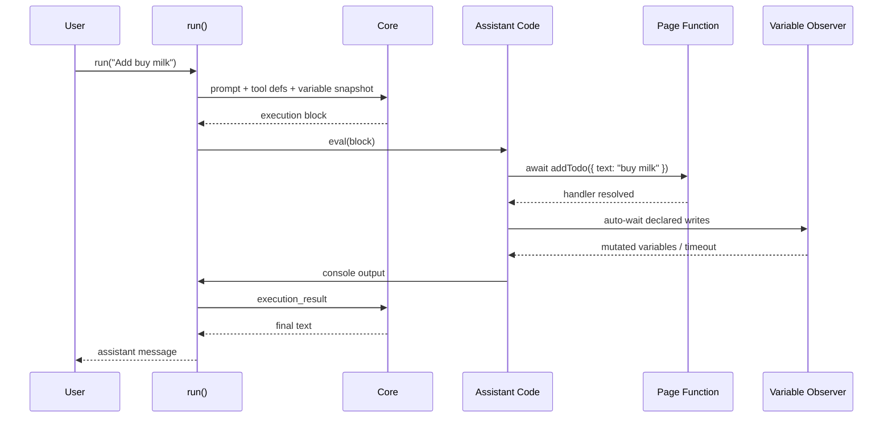
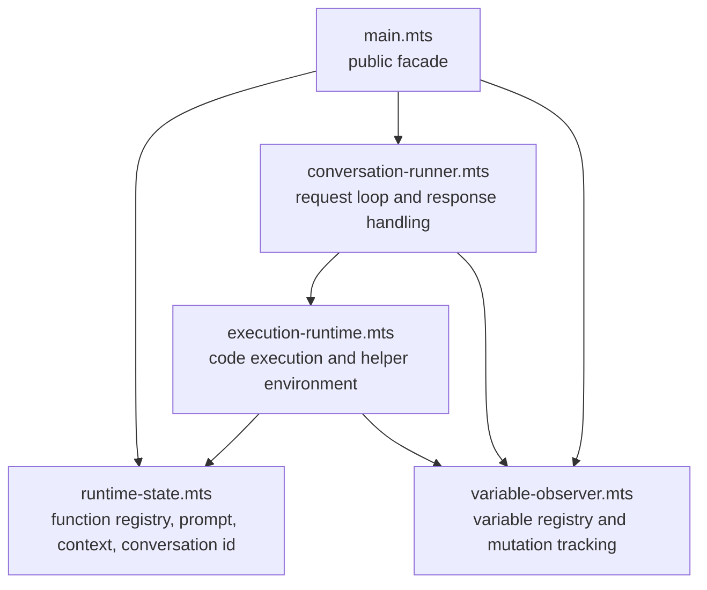

# @page-use/client

TypeScript runtime for wiring page state, page functions, and the Page Use conversation loop together.

## Installation

```bash
pnpm add @page-use/client zod
```

## Quick Start

```ts
import {
    registerFunction,
    run,
    setSystemPrompt,
    setVariable,
} from '@page-use/client';
import {z} from 'zod';

setSystemPrompt(
    'You are helping the user interact with a todo list application.',
);

setVariable({
    name: 'items',
    value: [],
    type: z.array(
        z.object({
            id: z.string(),
            text: z.string(),
            completed: z.boolean(),
        }),
    ),
});

registerFunction({
    name: 'addTodo',
    input: z.object({
        text: z.string(),
    }),
    output: z.object({
        ok: z.literal(true),
    }),
    writes: ['items'],
    mutationTimeoutMs: 750,
    func: async ({text}) => {
        await addTodoInYourApp(text);
        return {ok: true};
    },
});

const runHandle = run('Add "buy milk" to the list', {
    onMessage: (message) => {
        console.log('assistant:', message);
    },
    onUpdate: (update) => {
        console.log('update:', update);
    },
    onError: (error) => {
        console.error('page-use error:', error);
    },
});

await runHandle.done;
```

## Runtime Model

`@page-use/client` keeps a small in-memory runtime:

- registered variables: values the model can read through `variables.*`
- registered functions: async functions the model can call directly
- context information: extra text blocks injected into the system prompt
- a conversation id: reused across turns until you reset it
- a single active run lock: only one `run(...)` can execute at a time

The conversation loop sends:

- the current system prompt
- context information
- a serialized snapshot of current variables
- TypeScript signatures for registered functions
- a TypeScript interface describing the `variables` object

The core service responds with either plain text or an execution block. Execution blocks are evaluated inside a constrained runtime that exposes:

- registered page functions
- `variables`
- `delay(ms)`
- `runInAnimationFrames(...)`
- `waitForMutation([...])`
- a stubbed `console`
- `abortSignal`

## Variable Mutations

Variable updates are asynchronous from the model's point of view.

- `writes` is optional metadata on `registerFunction(...)`.
- When `writes` is present, the client automatically waits for those variables after the function handler resolves.
- Automatic waits use a default timeout of `5s`.
- When `mutationTimeoutMs` is present, it overrides that automatic post-function timeout.
- When `writes` is omitted, no automatic wait happens.
- `waitForMutation([...])` is always available to the generated code for extra variables, narrower waits, or functions without declared writes.
- Manual `waitForMutation([...])` calls also use a default timeout of `5s` and return the variable names that changed before timing out.

This means `await addTodo(...)` can already include a wait for declared writes, while `await waitForMutation([...])` remains the explicit escape hatch.

## End-To-End Flow

1. Your app registers variables and page functions.
2. `run(userPrompt)` snapshots the current runtime and sends a converse request to core.
3. Core returns either assistant text or an execution block.
4. The client evaluates the execution block with the registered functions and helpers in scope.
5. If a called function declared `writes`, the client waits for those variables to mutate before letting that function resolve.
6. Execution logs are sent back to core as an `execution_result` block.
7. Core can respond with another execution block or final assistant text.



## Module Layout



## Examples

### Function With Declared Writes

Use `writes` when your function is expected to change exposed variables and you want the runtime to wait automatically.

```ts
registerFunction({
    name: 'toggleTodo',
    input: z.object({
        id: z.string(),
    }),
    output: z.object({
        ok: z.literal(true),
    }),
    writes: ['items', 'remainingCount'],
    func: async ({id}) => {
        await toggleTodoInYourApp(id);
        return {ok: true};
    },
});
```

### Function With `mutationTimeoutMs`

Use `mutationTimeoutMs` when a function should not wait indefinitely for declared write mutations.

```ts
registerFunction({
    name: 'saveDraft',
    input: z.object({
        text: z.string(),
    }),
    output: z.object({
        ok: z.literal(true),
    }),
    writes: ['draftStatus'],
    mutationTimeoutMs: 500,
    func: async ({text}) => {
        await saveDraftInYourApp(text);
        return {ok: true};
    },
});
```

If `draftStatus` does not update within `500ms`, the runtime emits a `state_wait_timeout` update and continues.

### Function Without Declared Writes

When `writes` is omitted, the model can still decide what to wait for through `waitForMutation([...])`.

Registered function:

```ts
registerFunction({
    name: 'recalculateTotals',
    input: z.object({}),
    output: z.object({
        ok: z.literal(true),
    }),
    func: async () => {
        await recalculateTotalsInYourApp();
        return {ok: true};
    },
});
```

Typical generated code:

```ts
await recalculateTotals({});
const changedVariables = await waitForMutation(['subtotal', 'grandTotal']);
console.log(changedVariables);
console.log(variables.grandTotal);
```

### React Mapping

`@page-use/react` is a thin wrapper over this package:

- `PageUseSystemPrompt` calls `setSystemPrompt(...)`
- `PageUseVariable` calls `setVariable(...)` and `unsetVariable(...)`
- `PageUseFunction` calls `registerFunction(...)`
- `PageUseChat` eventually calls `run(...)`

Use `@page-use/client` directly when you want full control outside React or when you want to understand the exact runtime behavior.

## API Notes

- `run(...)` is single-flight. Starting a second run while one is active throws.
- Registered variables are exposed as a read-only live `variables` object inside generated code.
- Registered functions are validated with their Zod input schema before the handler runs.
- Function registrations and tool definitions are refreshed at the start of each converse-loop turn.
- `mutationTimeoutMs` only applies to the automatic wait driven by `writes`.
- If `writes` is present and `mutationTimeoutMs` is omitted, the automatic wait uses the default `5s` timeout.
- `waitForMutation([...])` also uses the default `5s` timeout and returns the variable names that mutated before timeout.

## TODO: Tests

Future automated coverage should include:

- variable waiter lifecycle and cleanup
- mutation detection with and without a timeout
- automatic `writes`-based waiting after function handlers resolve
- manual `waitForMutation([...])` behavior across multiple waits in one execution
- run loop retry behavior for invalid conversation history
- React wrapper compatibility with emitted `TRunUpdate` variants
